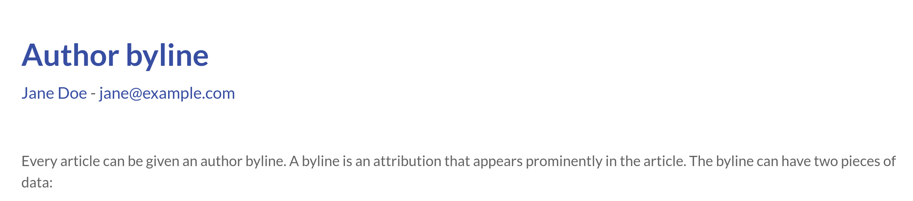

:toc:

Every article can be given an author byline.
A byline is an attribution that appears prominently in the article.
The byline can have two pieces of data:

. Author name
. Author email address

The data is specified by adding front-matter to article.
See the example below:


author: Jane Doe
authorEmail: jane@example.com


.Byline in an article
[#img-sunset]

