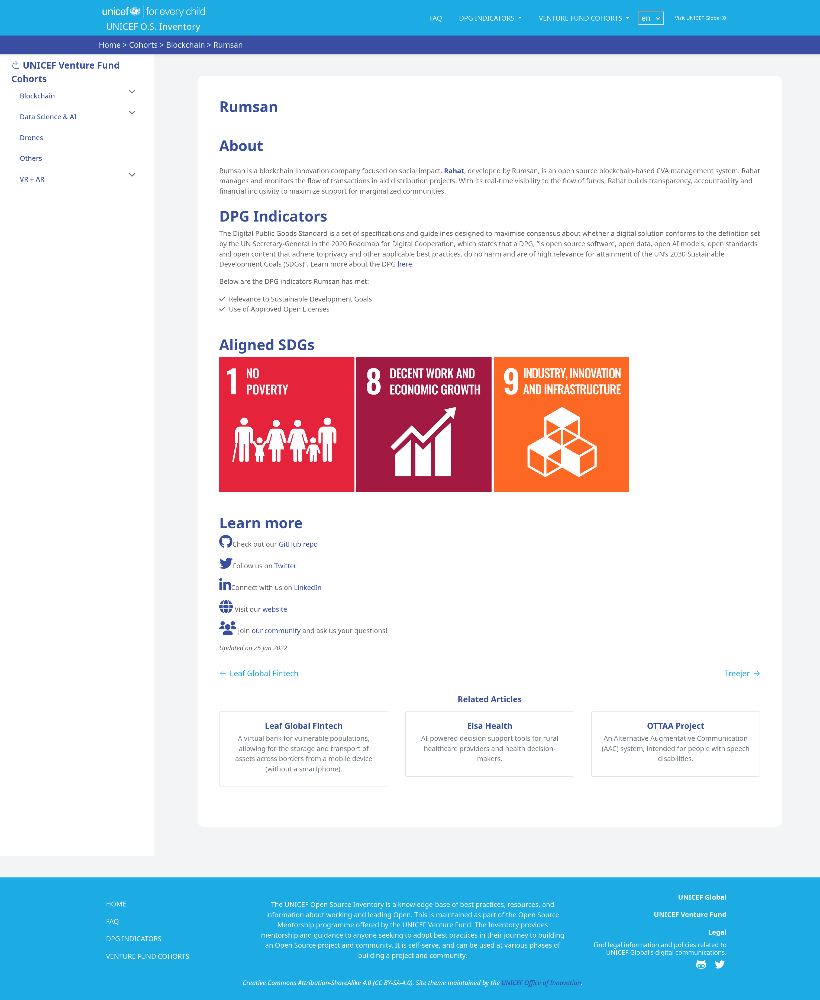

:toc:

The UNICEF Inventory theme includes a *Teams Profile* feature designed for the https://www.unicefinnovationfund.org/[UNICEF Venture Fund].
Team Profiles allow a site maintainer to create thematic groups of profiles that represent a team, company, or other organization that is building Open Source products that align to the United Nations Sustainable Development Goals.
Profiles using this layout will have a special appearance compared to other content published on the site.

[[motivation]]
== Feature motivation

The UNICEF Venture Fund works with many startup companies in an investment cohort.
Each thematic cohort can have anywhere from two to ten startup companies on average.
For all startup companies receiving investment from UNICEF, they have a requirement to seek recognition as a Digital Public Good (DPG).
Each company must meet all of the indicators of the Digital Public Good Standard to achieve recognition.

The Team Profiles feature is a profile tool to help UNICEF portfolio managers and startup company staff understand total progress in achieving the DPG Standard.
This provides a public, transparent evaluation of the Open Source work created by the startup company.
It provides a common, useful knowledge to multiple stakeholders, including the reviewer committee of the Digital Public Goods Alliance.

[[demo]]
== Demo: UNICEF Open Source Inventory

See this feature in action https://unicef.github.io/inventory/cohorts/[*on the UNICEF Open Source Inventory*].

[[config]]
== Profile configuration

See the front-matter of an example profile below:

.example-profile.md
[source,yaml]
----
---
title: FOSS in a Box
tags: ["data science", "financial inclusion"]
type: profiles

description: An example company for demonstration purposes.
country: Nepal
# usually the induction date of the cohort
date: 2022-08-30
github: https://github.com/example-fossbox
linkedin: https://www.linkedin.com/company/example-fossbox/
twitter: https://twitter.com/example-fossbox
website: https://example.com/
community: https://example.com/contact
# commit a logo to the same folder as the page
logo: example-fossbox.png
sdgs:
    - 1
    - 8
    - 9
dpgs:
    - 1
    - 2
    - 3
    - 5
    - 7
    - 8
    - 9

---
----

[[example]]
== Example: Rumsan Team Profile

[link=https://unicef.github.io/inventory/cohorts/blockchain/rumsan/]

