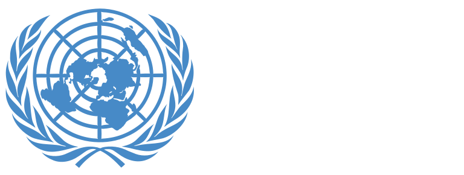

The Sustainable Development Goals (SDGs), also known as the Global Goals, were adopted by the United Nations in 2015 as a universal call to action to end poverty, protect the planet, and ensure that by 2030 all people enjoy peace and prosperity.

At the United Nations SDG website, you will get enlightened about the goals and the criteria behind each goal.